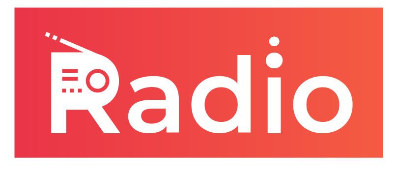

## Live Radio



Application built for sharing information about film and audio industry. This app also includes radio books, reviews from critics, analytics of reviews. Below you can find technical characteristics of the application.

## Features

* React
* Mobile friendly layout (responsive)
* React Router
* Bootstrap3
* GraphQL
* Nodejs backend
* Sass styles
* Webpack build
* Stylish, clean, responsive layout
* Authentication

## Quick Start

#### 1. Get the latest version

You can start by cloning the latest version of Live Radio on your
local machine by running:

```
$ git clone https://github.com/vazgenbarfyan/live-radio.git
$ cd MyApp
```

#### 2. Run `yarn install`

This will install both run-time project dependencies and developer tools listed
in [package.json](../package.json) file.

#### 3. Run `yarn start`

This command will build the app from the source files (`/src`) into the output
`/build` folder. As soon as the initial build completes, it will start the
Node.js server (`node build/server.js`).

Now you can open our web app in a browser, on mobile devices and view it. Note that the template used is flatlogic's [template](https://github.com/flatlogic/react-dashboard). Whenever you modify any of the source files inside the `/src` folder,
the module bundler ([Webpack](http://webpack.github.io/)) will recompile the
app on the fly and refresh all the connected browsers.

For more info please refer to [getting started](./docs/getting-started.md) guide to download and run the project (Node.js >= 6.5)
